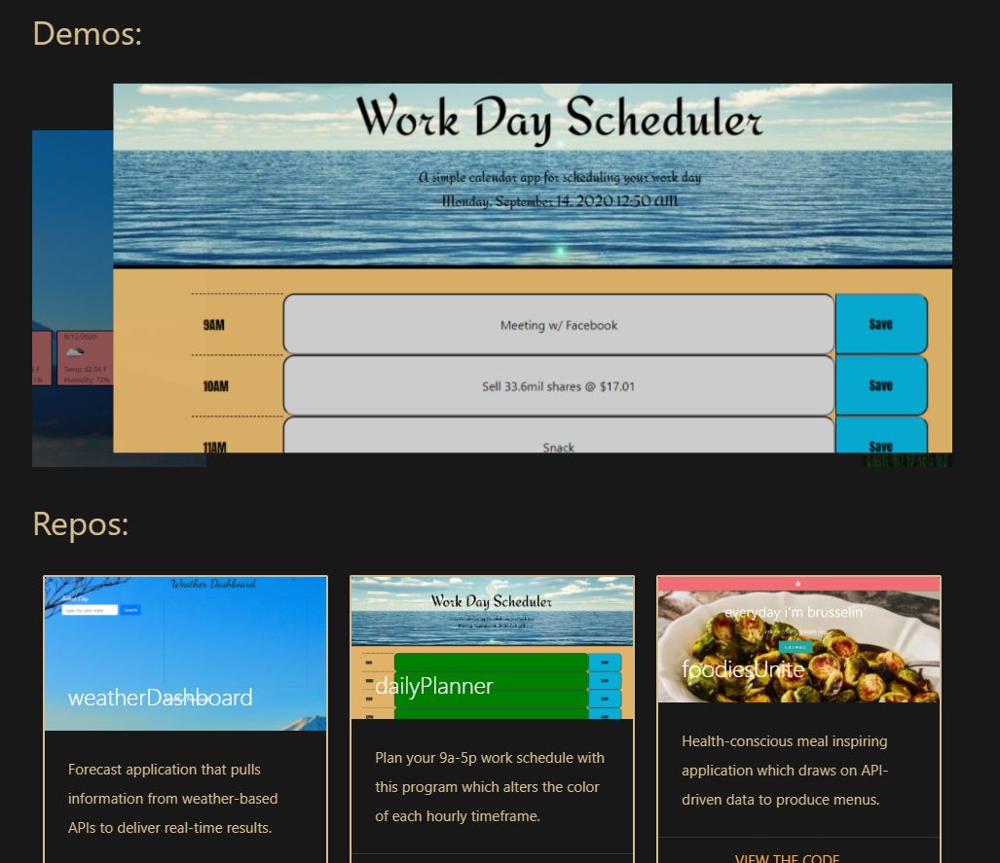

# Portfolio :page_with_curl:

## Table of Contents
- [Description](#description)
- [Technology](#technology)
- [Contributors](#contributors)
- [Contact](#contact)

## Description

### Live Demo: https://94cooper94.github.io/portfolio/  

  Welcome to the thoroughly crafted & maintained portfolio of Cooper Ahearn. You'll find a link to the deployed site above, so that you may view samples of my work & read up on my background. You'll find that each section is carefully designed to capture my quarky personality while also featuring the most attractive facet of each included project.

## Technology
- GitHub & GitHub Pages
- HTML & CSS
- Materialize CSS & JavaScript Bootstrap
- JavaScript & JQuery

## Contributor

 
Cooper Ahearn - Designer & Developer

## Contact :email:

Connect with & contact directly via LinkedIn:

Cooper Ahearn - <a href="https://www.linkedin.com/in/lcahearn/">LCAhearn</a>